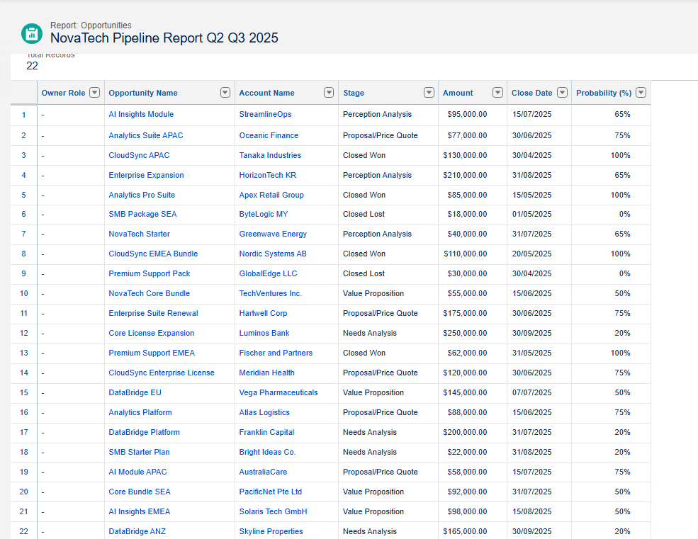
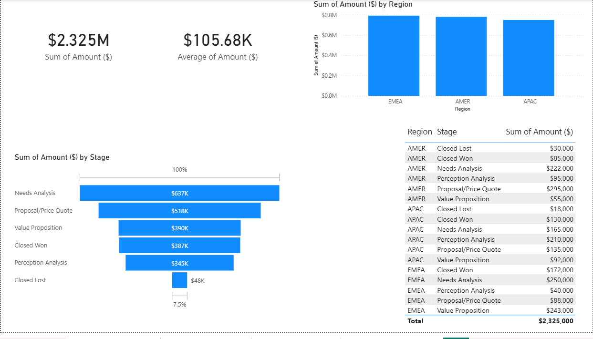
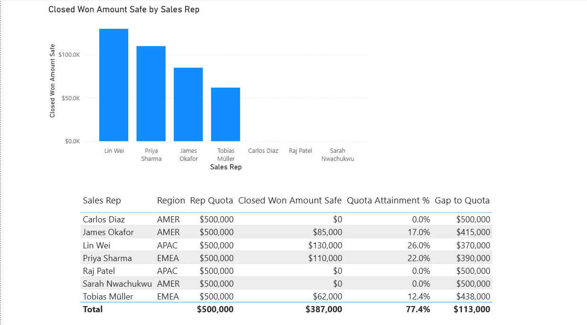
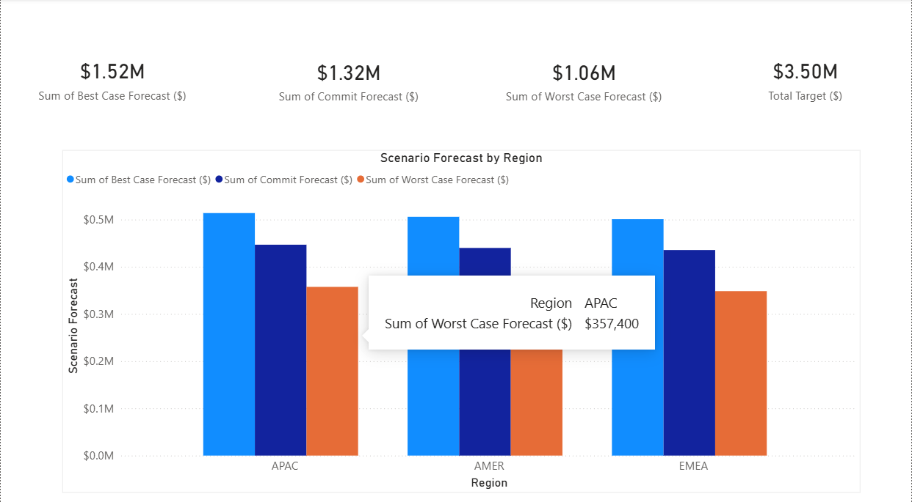
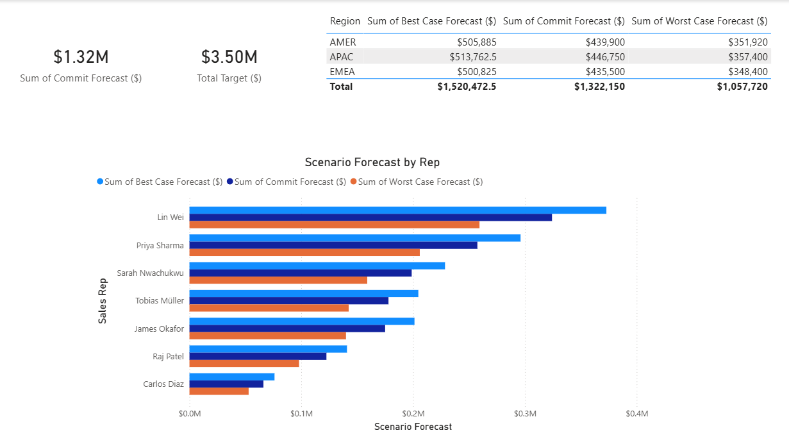

# M1 - Revenue Forecast Model

**Company:** NovaTech Solutions (fictional B2B SaaS)  
**Tools:** Salesforce, Microsoft Excel, Power BI  
**Niche:** Sales Analytics / Finance  
**Status:** Complete

---

## Project Summary

NovaTech Solutions needed a structured way to forecast quarterly revenue across three regions - AMER, EMEA, and APAC. This project builds a full forecast model from raw pipeline data through to an interactive Power BI dashboard, covering three scenarios: Best Case, Worst Case, and Commit.

The pipeline data was entered directly into Salesforce and exported into Excel, where weighted probability calculations and scenario adjustments were applied. Power BI connects to the Excel model and visualizes pipeline health, quota attainment by rep, forecast vs target, and scenario comparisons across all three regions.

---

## What Was Built

### Salesforce
- 22 Accounts created for NovaTech's fictional customer base
- 22 Opportunities entered across AMER, EMEA, and APAC covering six pipeline stages
- Custom report built: **NovaTech Pipeline Report Q2 Q3 2025** showing Opportunity Name, Account Name, Stage, Amount, Close Date, and Probability

### Excel Workbook
Five-tab workbook covering the full data model:

| Tab | Purpose |
|---|---|
| Pipeline Data | 22 opportunities with stage, amount, probability, weighted amount, close date, region, rep, and lead source |
| Best Case | Scenario model applying a 1.15x multiplier to weighted pipeline, with pipeline by region and quota attainment by rep |
| Worst Case | Scenario model applying a 0.80x multiplier, same structure as Best Case |
| Commit | Base scenario at 1.00x, representing the most likely outcome |
| PBI Data Model | Flat export table combining all scenario forecasts per opportunity row, used as the Power BI data source |

Key formulas used: SUMPRODUCT, COUNTIFS, DIVIDE, scenario multiplier logic, weighted probability calculations.

### Power BI Dashboard
Four report pages built on top of the PBI Data Model tab:

| Page | Content |
|---|---|
| Pipeline Overview | Total pipeline card, average deal size card, pipeline by region column chart, deal stage funnel |
| Quota Attainment | Closed Won revenue by rep (column chart), quota vs actual table with attainment % and gap to quota per rep |
| Forecast vs Target | Best Case, Commit, and Worst Case headline cards, total target card, scenario comparison by region grouped column chart |
| Scenario Comparison | Two headline cards (Commit vs Target), scenario forecast by rep horizontal bar chart, regional scenario breakdown table |

Five DAX measures built from scratch:
- Closed Won Amount
- Closed Won Amount Safe (replaces blank with $0 for reps with no closed deals)
- Quota Attainment %
- Gap to Quota
- Rep Quota (flat $500,000 per rep regardless of deal count)

---

## Key Numbers

| Metric | Value |
|---|---|
| Total Pipeline | $2,325,000 |
| Average Deal Size | $105,682 |
| Best Case Forecast | $1,520,473 |
| Commit Forecast | $1,322,150 |
| Worst Case Forecast | $1,057,720 |
| Total Team Quota | $3,500,000 |
| Closed Won (to date) | $387,000 |
| Overall Attainment | 11.1% |

---

## Deliverables

| File | Description |
|---|---|
| `NovaTech_M1_Revenue_Forecast_Model.xlsx` | Five-tab Excel workbook with pipeline data, three scenario models, and Power BI data model tab |
| `NovaTech_M1_Revenue_Forecast_Dashboard.pbix` | Power BI Desktop file with four report pages and five DAX measures |
| `NovaTech_Pipeline_Report_Screenshot.png` | Salesforce pipeline report showing all 22 opportunities |
| `NovaTech_Pipeline_Overview_Screenshot.png` | Power BI Pipeline Overview page |
| `NovaTech_Quota_Attainment_Screenshot.png` | Power BI Quota Attainment page |
| `NovaTech_Forecast_vs_Target_Screenshot.png` | Power BI Forecast vs Target page |
| `NovaTech_Scenario_Comparison_Screenshot.png` | Power BI Scenario Comparison page |

---

## Notes

- Salesforce org is a Developer Edition. All 22 opportunities and 22 accounts were created manually.
- Currency was set to USD at the org level before the pipeline report was built.
- Power BI publish-to-web requires a Pro license. The .pbix file is included in this repo for anyone who wants to open the dashboard locally in Power BI Desktop (free).
- Quota is set at $500,000 per rep annually across all seven reps ($3.5M total team quota).

---

## Screenshots

### Salesforce Pipeline Report

### Power BI - Pipeline Overview

### Power BI - Quota Attainment

### Power BI - Forecast vs Target

### Power BI - Scenario Comparison

---

LinkedIn: https://www.linkedin.com/in/michael-adedayo-dami/
